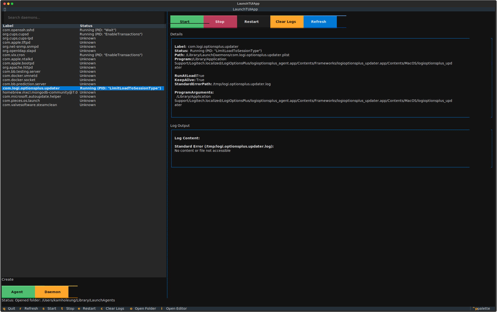

# LaunchTUI

A terminal user interface for managing macOS launch daemons and launch agents. LaunchTUI provides a convenient TUI for viewing, starting, stopping, and restarting system services without memorizing complex `launchctl` commands.



## Features

- 📋 View all launch daemons and agents in a clean table interface
- 🔍 Search and filter services by name or program path
- ▶️ Start, stop, and restart services with keyboard shortcuts
- 📊 View detailed service information and configuration
- 📝 Display stdout/stderr logs for services with logging configured
- 🔄 Real-time service status updates

## Installation

### Prerequisites

- macOS 10.15+ (Catalina or later)
- Python 3.10 or later
- [uv](https://docs.astral.sh/uv/) package manager

### Install from source

```bash
# Clone the repository
git clone <repository-url>
cd LaunchTUI

# Install dependencies
uv sync

# Install the package
uv pip install -e .
```

## Usage

⚠️ **Important**: Managing launch daemons requires root privileges. You'll need to run LaunchTUI with `sudo` to control system services:

```bash
sudo uv run launchtui
```

For user-level launch agents (in `~/Library/LaunchAgents`), you can run without `sudo`:

```bash
uv run launchtui
```

### Controls

- **q** - Quit the application
- **r** - Refresh the service list
- **s** - Start selected service
- **t** - Stop selected service  
- **e** - Restart selected service
- **↑/↓** - Navigate service list
- **Type** - Search/filter services

### Interface

The interface is divided into two main panels:

**Left Panel:**
- Search bar for filtering services
- Service table showing Label, Status, and Program
- Control buttons (Start, Stop, Restart, Refresh)

**Right Panel:**
- Service details showing configuration from plist files
- Log output displaying stdout/stderr when available

## Service Locations

LaunchTUI scans the following directories:

- `/System/Library/LaunchDaemons` - System-level daemons (requires sudo)
- `/Library/LaunchDaemons` - System-wide daemons (requires sudo)
- `~/Library/LaunchAgents` - User-level agents

## Troubleshooting

### Permission Denied

If you get permission errors when trying to start/stop services:

1. Make sure you're running with `sudo` for system daemons
2. Check that the service exists and is properly formatted
3. Some system services may be protected by SIP (System Integrity Protection)

### Services Not Showing

- Ensure the plist files are properly formatted
- Check that you have read permissions for the directories
- Apple services (starting with `com.apple`) are filtered out by default

### Logs Not Available

- Not all services configure log paths in their plist files
- Check the service's `StandardOutPath` and `StandardErrorPath` settings
- Log files may be in locations requiring additional permissions

## Development

```bash
# Install development dependencies
uv sync

# Run in development mode
uv run python -m launchtui.app

# Build package
uv build

# Run linting (if ruff is configured)
uv run ruff check .
uv run ruff format .
```